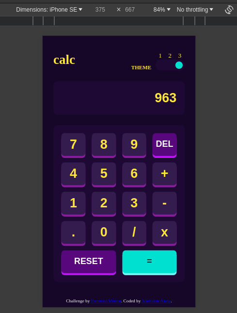
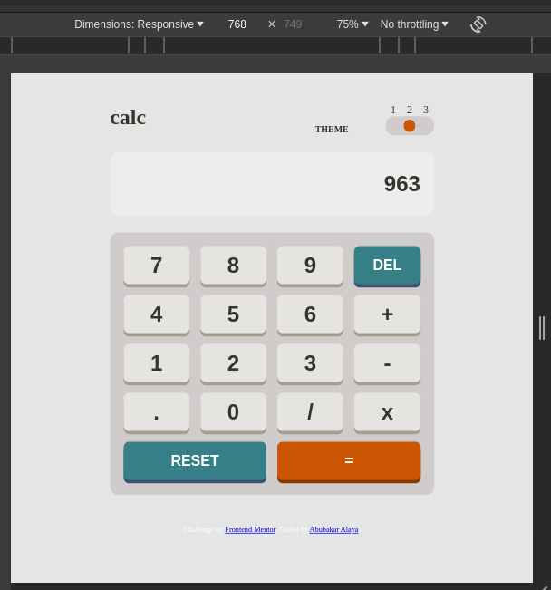
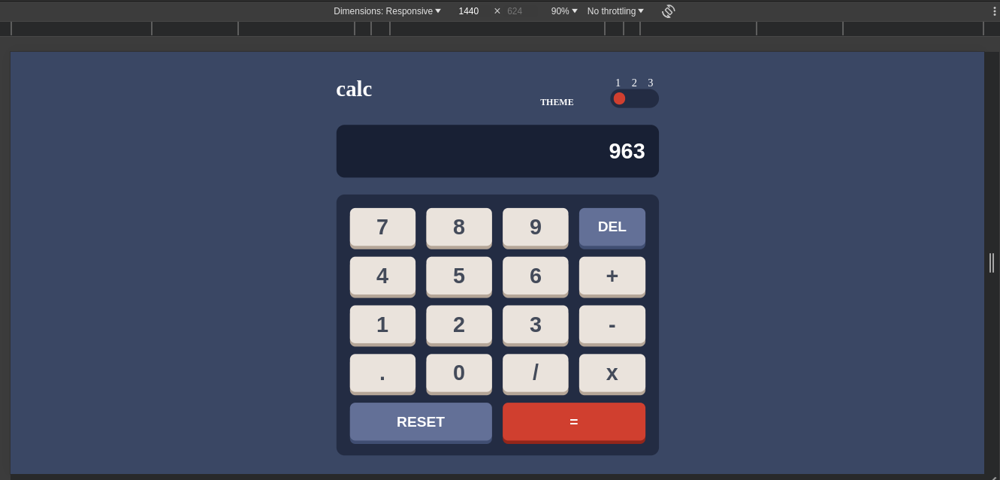

# Frontend Mentor - Calculator app solution

This is a solution to the [Calculator app challenge on Frontend Mentor](https://www.frontendmentor.io/challenges/calculator-app-9lteq5N29). Frontend Mentor challenges help you improve your coding skills by building realistic projects. 

## Table of contents

- [Frontend Mentor - Calculator app solution](#frontend-mentor---calculator-app-solution)
  - [Table of contents](#table-of-contents)
  - [Overview](#overview)
    - [The challenge](#the-challenge)
    - [Screenshot](#screenshot)
    - [Links](#links)
  - [My process](#my-process)
    - [Built with](#built-with)
    - [What I learned](#what-i-learned)
    - [Continued development](#continued-development)
  - [Author](#author)
  - [Acknowledgments](#acknowledgments)

## Overview

### The challenge

Users should be able to:

- See the size of the elements adjust based on their device's screen size
- Perform mathmatical operations like addition, subtraction, multiplication, and division
- Adjust the color theme based on their preference

### Screenshot






### Links

- Solution URL: [Add solution URL here](https://github.com/Ecode2/calculator-app)
- Live Site URL: [Add live site URL here](https://ecode2.github.io/calculator-app)

## My process

### Built with

- Semantic HTML5 markup
- CSS custom properties
- Flexbox
- CSS Grid
- Mobile-first workflow
- Vanila JAVASCRIPT

### What I learned

I got to improve on my design skills by using different properties that i otherwise don't use. And my javascript skills have improved significantly because of this project.

```css
.proud-of-this-css {
  display: grid;
  grid-template-columns: repeat(4, 1fr);
  grid-auto-rows: 3rem;
  column-gap: 1rem;
  row-gap: 1.5rem;
  grid-template-areas: 
  "r7 r8 r9 rd"
  "r4 r5 r6 rp"
  "r1 r2 r3 rs"
  "rf r0 rd rm"
  "rr rr re re";
}
.and-this li:nth-child(n+4):nth-child(-n+4) > button{
        font-size: calc(var(--NumFontSize)/1.5);
        background: var(--DarkKeyBtnBgColor);
        color: var(--CtrlBtnFgColor);
        box-shadow: 0 5px 0 var(--DarkKeyBtnShadowColor);
    }
```
```js
const proudOfThisFunc = () => {
   expression.forEach((value, index) => {
        if (value === "x") {
            expression[index] = "*";
        }
    });
}
```

### Continued development

This was a fun project and i hope to recreate it with a frontend library like REACT with TYPESCRIPT.

## Author

- Frontend Mentor - [@Ecode2](https://www.frontendmentor.io/profile/Ecode2)
- Twitter - [@alaya_abubakar](https://www.twitter.com/alaya_abubakar)

## Acknowledgments

Shout out to my friend CLEMENT for explaining things for me when i needed it.
